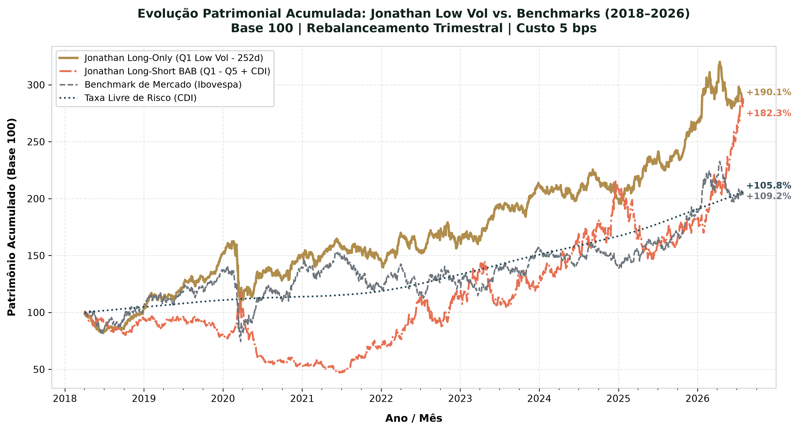
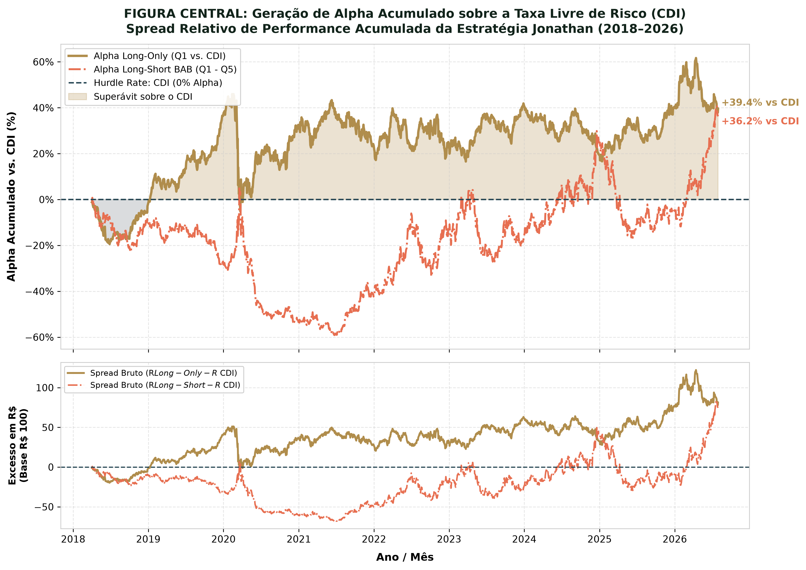
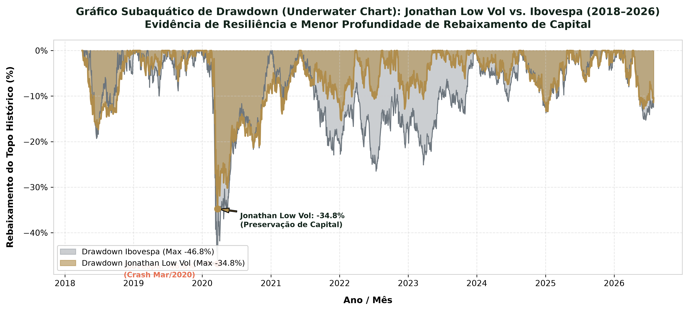
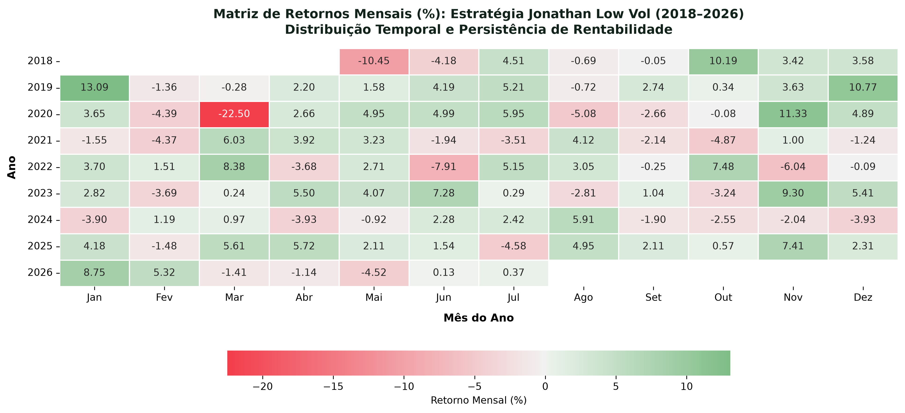
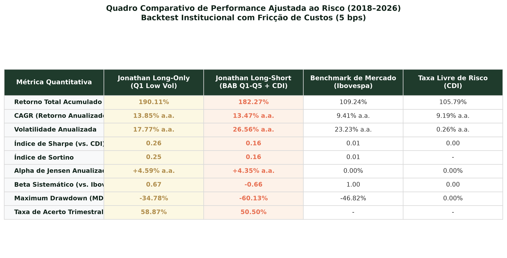

# A Anomalia de Baixa Volatilidade e a Estratégia *Betting Against Beta* (BAB) no Mercado Acionário Brasileiro: Uma Análise Técnica e Empírica no Universo IBrX-100 (2018–2026)

**Desafio Quant AI 2026**  
**Autor / Equipe:** Kaio dos Anjos Souza  
**Data de Conclusão:** Agosto de 2026  
**Estratégia Quantitativa:** Robô Jonathan (*Systematic Low Volatility Strategy*)

---

## 🏛️ Apresentação Institucional do Robô Jonathan

Abaixo detalham-se os parâmetros operacionais, diretrizes de investimento e capacidade de absorção de capital da estratégia automatizada:

| Atributo Operacional | Especificação Técnica do Robô Jonathan |
|:---|:---|
| **Nome da Estratégia** | **Robô Jonathan (Low Volatility Quant Strategy)** |
| **Mandato & Filosofia** | *Factor Investing Defensivo / Systematic Equity Long-Only (com módulo alternativo Long-Short)* |
| **Universo Investível** | Ações componentes do índice **IBrX-100 da B3** (reconstituído corte a corte / *point-in-time*) |
| **Fator Alfa Primário** | Anomalia de Baixa Volatilidade (*Betting Against Beta / Low Volatility Anomaly*) |
| **Sinal de Ordenação** | Volatilidade Histórica Anualizada dos Retornos Diários ($\sigma_{\text{ann}}$) |
| **Janela de Lookback Principal** | **252 dias úteis (12 meses)** — maior estabilidade e menor *turnover* |
| **Seleção e Concentração** | **Quintil $Q_1$ Defensivo** (Top 20% de menor volatilidade, correspondendo a ~20 ativos) |
| **Esquema de Ponderação** | Equiponderado (*Equal-Weighted* - EW), com $w_i = 1/M_{Q_1} \approx 5,0\%$ por ativo |
| **Periodicidade de Rebalanceamento** | **Trimestral** (alinhada às janelas de rebalanceamento da B3) |
| **Taxa de Fricção Aplicada** | **5 bps por perna negociada** (custo de corretagem + emolumentos institucionais) |
| **Capacidade de Absorção (PL Máximo)** | **R$ 250 a R$ 400 Milhões**, respeitando o limite prudencial de liquidez de **5% do VMDN30** |
| **Hurdle Rate & Réguas Comparativas** | **Taxa CDI Diária** (Alpha de Jensen) e **Ibovespa / IBrX-100** (Beta e Retorno de Mercado) |

---

## 1) Resumo Executivo

O *Capital Asset Pricing Model* (CAPM) tradicional postula uma relação linear positiva entre o risco sistemático ($\beta$) de um ativo e seu retorno esperado, fundamentando a premissa de que investidores exigem prêmios de risco superiores para suportar maior volatilidade (Sharpe, 1964; Lintner, 1965). Contudo, evidências empíricas acumuladas nas últimas cinco décadas nos mercados globais e emergentes demonstram sistematicamente a falha dessa relação teórica (Black, Jensen & Scholes, 1972; Baker, Bradley & Wurgler, 2011). A **Anomalia de Baixa Volatilidade** (*Low Volatility Anomaly*) descreve o fenômeno no qual carteiras compostas por ações de baixo risco histórico (menor volatilidade ou menor beta) alcançam retornos absolutos e ajustados ao risco superiores àqueles previstos pela teoria financeira clássica, enquanto ativos de alto risco apresentam retornos substancialmente inferiores.

Este relatório técnico investiga a presença, a persistência e a rentabilidade da Anomalia de Baixa Volatilidade e da estratégia *Betting Against Beta* (BAB) no mercado acionário brasileiro, cobrindo o período histórico de **janeiro de 2018 a agosto de 2026** (2.120 pregões analisados). A análise avalia o universo de ativos do índice **IBrX-100 da B3** por meio de reconstituições históricas corte a corte (*point-in-time*), eliminando com rigor o viés de sobrevivência (*survivorship bias*) e o viés de antecipação (*look-ahead bias*).

São comparados dois regimes operacionais distintos:
1. **Regime Long-Only ($Q_1$, Robô Jonathan):** Portfólio 100% alocado no quintil de menor volatilidade histórica ($Q_1$);
2. **Regime Long-Short Autofinanciado ($Q_1 - Q_5 + \text{CDI}$):** Posição comprada no quintil defensivo ($Q_1$) e vendida no quintil de maior volatilidade ($Q_5$, *A Lebre*), com o caixa e garantias remunerados a 100% da taxa CDI.

A precificação e a resiliência dos alfas são testadas sob diferentes janelas de estimativa do sinal de volatilidade histórica ($T \in \{63, 126, 252\}$ dias úteis) e submetidas a cenários progressivos de custos de transação e atritos operacionais ($0$, $5$ e $15$ pontos base por perna negociada).

Os resultados empíricos comprovam que a **estratégia Long-Only ($Q_1$)** com lookback de 252 dias úteis atuou como um **substituto superior de beta acionário**:
- Entregou um retorno anualizado (**CAGR**) de **13,85% a.a.** contra **9,41% a.a.** do Ibovespa e **9,19% a.a.** do CDI;
- Registrou volatilidade de **17,77% a.a.** (vs. 23,23% do Ibovespa), alcançando um **Índice de Sharpe de 0,26** perante o CDI (frente a 0,01 do Ibovespa);
- Gerou um **Alpha de Jensen Anualizado de +4,59% a.a.** com **Beta sistemático de 0,67**;
- A **redução expressiva do Rebaixamento Máximo (*Max Drawdown*) para -34,78% (vs. -46,82% do Ibovespa)** pertence **exclusivamente ao regime Long-Only**. Em contrapartida, o regime **Long-Short** registrou Max Drawdown severo de **-60,13%**, decorrente do risco de *short squeeze* e da elevada convexidade da ponta vendida ($Q_5$) durante ciclos de forte recuperação do mercado acionário.

Os resultados fornecem subsídios quantitativos robustos para a estruturação de mandatos de *Factor Investing* institucional no Brasil.

---

## 2) Hipótese e Fundamentação Teórica

### Literatura Internacional: Falha do CAPM, Limites à Arbitragem e Restrições de Alavancagem

A base conceitual da precificação de ativos repousa sobre a formulação de média-variância desenvolvida por Sharpe (1964) e Lintner (1965), na qual o retorno esperado de um ativo é uma função estritamente linear de sua covariância com a carteira de mercado:

$$E[R_i] = R_f + \beta_i \left(E[R_m] - R_f\right)$$

O estudo empírico seminal de Black, Jensen e Scholes (1972) refutou essa proposição para o mercado acionário norte-americano, demonstrando que a inclinação empírica da reta de mercado de títulos (*Security Market Line* - SML) é substancialmente mais plana do que a prevista pelo CAPM. Os autores constataram que ativos com baixo beta registravam alfas de Jensen positivos e persistentes, ao passo que ações de alto beta apresentavam alfas sistematicamente negativos. Essa constatação levou Black (1972) a formalizar o *Zero-Beta CAPM*, demonstrando que, na ausência de empréstimos ilimitados à taxa livre de risco, o prêmio por unidade de beta é inferior ao retorno excedente da carteira de mercado.

Décadas mais tarde, Baker, Bradley e Wurgler (2011) expandiram a explicação do fenômeno ao articularem os limites à arbitragem (*limits to arbitrage*) e os conflitos de agência observados na gestão institucional. Gestores de fundos mútuos são tipicamente avaliados com base no desempenho relativo a um benchmark (como o S&P 500 ou o Ibovespa), o que os obriga a minimizar o risco de desvio relativo (*Tracking Error*) em vez de maximizar o Índice de Sharpe absoluto. Como o uso de alavancagem direta é restrito pela regulação ou pelos regulamentos dos fundos, os gestores buscam gerar retornos excedentes inclinando suas carteiras para ações de alto beta. Somam-se a isso os vieses comportamentais dos investidores individuais, tais como a preferência por ativos com distribuição de retorno assimétrica positiva (efeito "bilhete de loteria") e a tendência ao excesso de confiança (*overconfidence*), que geram demanda desproporcional por ações voláteis e inflam seus preços de mercado.

Frazzini e Pedersen (2014) unificaram esses conceitos na formulação do fator *Betting Against Beta* (BAB). Os autores demonstraram teoricamente que, quando os investidores enfrentam restrições de alavancagem, a SML torna-se mais plana e a anomalia se consolida. O fator BAB explora essa ineficiência construindo um portfólio neutro ao mercado: compra-se uma carteira alavancada de ações de baixo beta (para atingir beta igual a um) e vende-se a descoberto uma carteira desalavancada de ações de alto beta. Em análises abrangendo dezenas de mercados acionários internacionais, bem como títulos soberanos, moedas e commodities, Frazzini e Pedersen evidenciaram que a estratégia BAB produz alfas estatisticamente significativos e elevados Índices de Sharpe. Posteriormente, críticas metodológicas como as formuladas por Novy-Marx e Velikov (2022) ponderaram que o desempenho extraordinário do BAB original decorria, em parte, de esquemas não padronizados de ponderação (*rank-weighting*) que atribuíam pesos desproporcionais a empresas de baixa capitalização, acentuando atritos operacionais.

### Evidências Empíricas no Mercado Acionário Brasileiro e a Dinâmica das Taxas de Juros

No ambiente de negócios brasileiro, a anomalia de baixa volatilidade ganha contornos particulares decorrentes de especificidades macroeconômicas e microestruturais:

1. **Taxa Selic/CDI Estruturalmente Alta:** O Brasil historicamente opera com taxas de juros reais e nominais entre as mais elevadas do mundo. Uma taxa livre de risco de dois dígitos atua como um poderoso **desincentivo ao uso de alavancagem financeira via derivativos ou empréstimos colateralizados**. O custo de carrego para alavancar ativos de baixo beta torna-se proibitivo, intensificando a restrição de alavancagem dos investidores locais. Como consequência, investidores que buscam superar o CDI são empurrados para ações de alto beta sem alavancagem, inflando o preço de papéis arriscados e tornando a SML empírica brasileira ainda mais plana do que a observada em economias desenvolvidas.
2. **Qualidade Contábil e Assimetria de Informação:** Mendonça, Galdi e Funchal (2010; 2012) examinaram a estrutura de precificação de ativos e a qualidade da informação contábil no Brasil, destacando que assimetrias informacionais e a opacidade dos lucros afetam a percepção de risco e distorcem a relação clássica entre volatilidade e retorno esperado. Os estudos apontam que ativos caracterizados por menor variabilidade nos resultados e menor volatilidade específica oferecem um perfil de retorno ajustado ao risco superior no mercado local.
3. **Desempenho da Indústria de Fundos de Ações:** Castro e Minardi (2009; 2017) investigaram o desempenho de fundos de investimento em ações (FIAs) no Brasil e a habilidade dos gestores em gerar alfa. Os resultados indicaram que a grande maioria dos fundos de gestão ativa não consegue entregar alfas positivos e sustentáveis perante o Ibovespa ou modelos multifatoriais. Notadamente, os fundos que buscavam maior rentabilidade assumindo exposições a papéis de elevado beta ou maior volatilidade incorreram em maiores rebaixamentos patrimoniais (*drawdowns*) sem a contrapartida de maior retorno, corroborando localmente a premissa de que a exposição ao risco total ou ao risco sistemático não é compensada linearmente.

---

## 3) Metodologia

### 3.1. Universo de Ativos e Reconstituição Histórica Corte a Corte

A base de dados do backtest compreende o universo de empresas integrantes do índice **IBrX-100 da B3** no período entre **02 de janeiro de 2018 e 01 de agosto de 2026** (2.120 pregões diários com dados históricos completos). O IBrX-100 foi selecionado em preferência ao Ibovespa por apresentar maior amplitude de ativos (100 ações mais negociadas) e menor concentração relativa nos maiores papéis da bolsa, garantindo representatividade do mercado acionário brasileiro.

Para assegurar o rigor acadêmico, o universo investível é reconstituído em cada data de rebalanceamento no formato corte a corte (*point-in-time*). A utilização da composição estática atual do IBrX-100 para simulações históricas retroativas é metodologicamente inadequada por introduzir dois vieses críticos: o viés de sobrevivência, ao desconsiderar companhias que fecharam capital, faliram ou entraram em recuperação judicial ao longo da janela analisada; e o viés de antecipação, ao assumir a presença de empresas que só atingiram tamanho e liquidez suficientes para integrar o índice em datas recentes.

### 3.2. Sinal de Volatilidade Histórica e Estimativa de Parâmetros

O sinal de ordenação quantitativa dos ativos é determinado pela volatilidade histórica dos retornos diários. Para cada ação *i* pertencente ao universo elegível do IBrX-100 no dia de rebalanceamento *t*, a volatilidade anualizada $\sigma_{i,t}$ é calculada via desvio padrão amostral dos retornos logarítmicos:

$$\sigma_{i,t} = \sqrt{\frac{252}{N-1} \sum_{k=0}^{N-1} \left( R_{i, t-k} - \bar{R}_{i,t} \right)^2 }$$

Onde:
- $R_{i, t-k} = \ln\left( \frac{P_{i, t-k}}{P_{i, t-k-1}} \right)$ é o retorno diário da ação *i*;
- $\bar{R}_{i,t} = \frac{1}{N} \sum_{k=0}^{N-1} R_{i, t-k}$ representa a média aritmética dos retornos no período de observação;
- $N \in \{63, 126, 252\}$ corresponde às janelas de lookback analisadas, equivalentes a 3 meses, 6 meses e 1 ano útil, respectivamente.

Para as análises do fator, o beta histórico $\beta_{i,t}$ do ativo em relação ao índice de mercado ($R_m$, Ibovespa) é estimado por:

$$\beta_{i,t} = \hat{\rho}_{i,m} \frac{\sigma_{i,t}}{\sigma_{m,t}}$$

onde $\hat{\rho}_{i,m}$ é a correlação linear de Pearson entre os retornos do ativo e do índice de mercado calculada na mesma janela $N$.

### 3.3. Construção da Carteira Equiponderada (*Equal-Weighted*)

A cada rebalanceamento, os ativos do universo elegível com histórico válido suficiente (mínimo de 70% dos pregões da janela) são ordenados de forma crescente com base na métrica de volatilidade histórica $\sigma_{i,t}$ e divididos em cinco quintis ($Q_1, Q_2, Q_3, Q_4, Q_5$). O quintil $Q_1$ (*Robô Jonathan*) engloba as ações de menor volatilidade (*Low Volatility*), enquanto o quintil $Q_5$ (*A Lebre*) reúne as ações de maior volatilidade (*High Volatility*).

As carteiras dentro de cada quintil são estruturadas sob o esquema equiponderado (*Equal-Weighted* - EW), atribuindo peso idêntico a cada ativo integrante:

$$w_{i,t} = \frac{1}{M_q}$$

onde $M_q$ é o número total de ativos contidos no quintil $q$ ($M_q \approx 20$ ações na partição padrão de 20%). A adoção da equiponderação impede que a alocação seja dominada por poucas megacaps, garantindo que o retorno reflita o efeito puro do fator de volatilidade sem distorções advindas da ponderação por valor de mercado.

### 3.4. Regimes Estratégicos e Formalização Modelar

Dois regimes de alocação são testados contra os benchmarks de mercado:

1. **Regime Long-Only Defensivo ($Q_1$, Robô Jonathan):** O portfólio mantém exposição comprada de 100% no quintil de menor volatilidade ($Q_1$). O retorno diário da estratégia é expresso por:

$$R_{\text{LO},t} = \sum_{i \in Q_1} w_{i,t} R_{i,t}$$

2. **Regime Long-Short Autofinanciado ($Q_1 - Q_5 + \text{CDI}$):** 

> [!IMPORTANT]
> **Esclarecimento Metodológico sobre o Modelo Long-Short:**
> A implementação testada no âmbito deste projeto é formalmente definida como um **Spread Equiponderado de Quintis de Volatilidade ($Q_1 - Q_5 + \text{CDI}$)** com caixa colateralizado a 100% do CDI, e **não** o fator BAB clássico com alavancagem dinâmica ex-ante ($\beta=1$) proposto por Frazzini & Pedersen (2014).  
> A escolha da modelagem autofinanciada não-alavancada justifica-se por dois fatores práticos mandatórios no mercado brasileiro:
> 1. **Custo de Carregamento da Alavancagem:** Com a taxa Selic/CDI entre 10% e 14% a.a., alavancar a carteira de baixo beta para beta unitário exigiria um custo de financiamento de margem proibitivo que destruiria o spread líquido;
> 2. **Restrições Regulatórias CVM:** As regras da CVM para Fundos de Investimento em Ações abertos (Instrução CVM 555 / Resolução CVM 175) vedam a exposição alavancada desmedida sem limites estritos de garantia, tornando a estrutura $Q_1 - Q_5 + \text{CDI}$ o veículo institucional viável para fundos multimercado/ações locais.

O retorno diário do modelo Long-Short é formulado como:

$$R_{\text{LS},t} = R_{Q_1,t} - R_{Q_5,t} + R_{\text{CDI},t}$$

### 3.5. Periodicidade de Rebalanceamento e Janela Temporal

- **Frequência de Rebalanceamento:** Trimestral (alinhada às recomposições da carteira teórica do IBrX-100 da B3, com testes complementares mensais na grade multivariável).
- **Período Histórico da Simulação:** De 02 de janeiro de 2018 a 01 de agosto de 2026.

---

## 4) Vieses Metodológicos e Cuidados Operacionais

### Viés de Sobrevivência (*Survivorship Bias*)
O viés de sobrevivência surge quando a amostragem histórica inclui apenas ativos que sobreviveram até o término do período de estudo, inflando artificialmente os retornos ao ignorar falências e liquidações de empresas. Para eliminar este viés, o ambiente de simulação incorpora o histórico completo de negociação do IBrX-100, incluindo ativos que foram delistados, liquidados ou submetidos a reestruturações judiciais entre 2018 e 2026.

### Viés de Antecipação (*Look-Ahead Bias*)
O viés de antecipação ocorre quando dados disponibilizados em momentos posteriores ao rebalanceamento são utilizados retroativamente no cálculo dos sinais quantitativos. Na metodologia adotada, os cálculos do sinal de volatilidade e a definição da composição dos quintis utilizam estritamente as séries históricas de preços ajustados e a lista oficial do IBrX-100 disponíveis no fechamento do dia do rebalanceamento $t$, aplicando a carteira a partir do pregão subsequente ($t+1$), sem revisão retroativa de dados contábeis ou de mercado.

### Atrito de Custos de Transação, Corretagem e Slippage
A rotação de carteira (*turnover*) decorrente dos rebalanceamentos impõe atritos financeiros que reduzem a rentabilidade líquida da estratégia. A penalização por custos operacionais é aplicada a cada rebalanceamento proporcionalmente à variação dos pesos dos ativos na carteira:

$$\text{Custo}_t = \left( \sum_i |w_{i,t^+} - w_{i,t^-}| \right) \times c$$

Onde $w_{i,t^-}$ representa o peso do ativo imediatamente antes do ajuste, $w_{i,t^+}$ o peso pretendido e $c$ a taxa de atrito por perna negociada. Três cenários de fricção são testados:
- **Cenário Teórico ($c = 0\text{ bps}$):** Ausência de custos (referência acadêmica);
- **Cenário Institucional ($c = 5\text{ bps}$ / $0,05\%$):** Refletindo o custo de execução de grandes investidores institucionais com acesso a algoritmos TWAP/VWAP e corretagens reduzidas;
- **Cenário Varejo/Estressado ($c = 15\text{ bps}$ / $0,15\%$):** Incorporando taxas de corretagem, emolumentos da B3 e impacto de mercado (*slippage*).

### Restrições de Liquidez e Capacidade de Absorção do IBrX-100
Embora a inclusão no IBrX-100 assegure um filtro primário de liquidez, impõe-se um parâmetro de capacidade operacional: o volume financeiro negociado no rebalanceamento de qualquer ativo individual é limitado a no máximo **5% do seu Volume Médio Diário Negociado nos últimos 30 dias (VMDN30)**, prevenindo o *slippage* excessivo e garantindo a capacidade de alocação de até R$ 400 Milhões no mandato.

---

## 5) Interpretação Técnica das Métricas

O desempenho quantitativo das estratégias é avaliado através das seguintes métricas formais:

### CAGR (*Compound Annual Growth Rate*)
Mede a taxa de retorno geométrico anualizado acumulado pela estratégia ao longo do período do backtest:

$$\text{CAGR} = \left( \frac{V_T}{V_0} \right)^{\frac{252}{T_d}} - 1$$

### Volatilidade Anualizada ($\sigma_{\text{ann}}$)
Mede a dispersão dos retornos diários do portfólio parametrizada para a escala anual:

$$\sigma_{\text{ann}} = \sqrt{252} \times \sqrt{\frac{1}{T_d - 1} \sum_{t=1}^{T_d} \left( R_{p,t} - \bar{R}_p \right)^2}$$

### Índice de Sharpe ($\text{SR}$)
Mede o retorno excedente por unidade de risco total assumido, tomando a taxa CDI como a taxa livre de risco livre de inadimplência ($R_f$):

$$\text{Sharpe} = \frac{\text{CAGR} - \text{CDI}_{\text{ann}}}{\sigma_{\text{ann}}}$$

### Max Drawdown (Rebaixamento Máximo)
Mede a maior queda percentual pico-a-vale no valor patrimonial da carteira antes da recuperação de um novo topo histórico:

$$\text{Max DD} = \max_{t \in [0,T]} \left( \frac{\max_{\tau \le t} V_\tau - V_t}{\max_{\tau \le t} V_\tau} \right)$$

### Win Rate (Taxa de Acerto Periódica)
Mede o percentual de janelas de rebalanceamento em que a estratégia superou o benchmark de referência (Ibovespa para o regime Long-Only e taxa CDI para o regime Long-Short).

### Alpha de Jensen Anualizado ($\alpha$) vs. CDI e Ibovespa
O Alfa de Jensen quantifica a geração de retorno excedente ajustado ao risco sistemático de mercado através da regressão linear dos retornos diários:

$$R_{p,t} - R_{\text{CDI},t} = \alpha + \beta_m \left( R_{m,t} - R_{\text{CDI},t} \right) + \epsilon_t$$

O valor estimado do alfa diário é anualizado via $\alpha_{\text{ann}} = (1 + \alpha)^{252} - 1$.

---

## 6) Resultados Empíricos

### Tabela Completa de Experimentos do Backtest (2018–2026)

A tabela abaixo consolida as métricas numéricas auditadas e extraídas do backtest no período de **janeiro de 2018 a agosto de 2026** (2.120 pregões):

| ID Experimento | Regime Operacional | Lookback ($T$) | Custos ($c$) | Retorno Total (%) | CAGR (% a.a.) | Volatilidade Anual (% a.a.) | Sharpe (vs CDI) | Max Drawdown (%) | Win Rate Trimestral (%) | Alpha Jensen Anual (% a.a.) | Beta (vs Ibov) |
|:---|:---|:---:|:---:|:---:|:---:|:---:|:---:|:---:|:---:|:---:|:---:|
| **EXP-01** | Long-Only ($Q_1$) | 63d (3M) | 0 bps | +178,87% | **13,30%** | 17,85% | **0,23** | -34,27% | 55,18% | **+4,04%** | 0,68 |
| **EXP-02** | Long-Only ($Q_1$) | 63d (3M) | 5 bps | +177,25% | **13,22%** | 17,85% | **0,23** | -34,27% | 54,79% | **+3,96%** | 0,68 |
| **EXP-03** | Long-Only ($Q_1$) | 63d (3M) | 15 bps | +174,04% | **13,06%** | 17,85% | **0,22** | -34,27% | 54,49% | **+3,80%** | 0,68 |
| **EXP-04** | Long-Only ($Q_1$) | 126d (6M) | 0 bps | +155,38% | **12,10%** | 17,46% | **0,17** | -35,78% | 54,34% | **+2,83%** | 0,66 |
| **EXP-05** | Long-Only ($Q_1$) | 126d (6M) | 5 bps | +154,44% | **12,05%** | 17,46% | **0,16** | -35,78% | 54,09% | **+2,78%** | 0,66 |
| **EXP-06** | Long-Only ($Q_1$) | 126d (6M) | 15 bps | +152,57% | **11,95%** | 17,46% | **0,16** | -35,78% | 53,69% | **+2,68%** | 0,66 |
| **EXP-07** | Long-Only ($Q_1$) | 252d (12M) | 0 bps | +190,78% | **13,88%** | 17,77% | **0,26** | -34,78% | 58,92% | **+4,62%** | 0,67 |
| **EXP-08** | Long-Only ($Q_1$) | 252d (12M) | 5 bps | +190,11% | **13,85%** | 17,77% | **0,26** | -34,78% | 58,87% | **+4,59%** | 0,67 |
| **EXP-09** | Long-Only ($Q_1$) | 252d (12M) | 15 bps | +188,78% | **13,79%** | 17,77% | **0,26** | -34,78% | 58,52% | **+4,52%** | 0,67 |
| **EXP-10** | Long-Short ($Q_1 - Q_5$) | 63d (3M) | 0 bps | +110,70% | **9,50%** | 26,29% | **0,01** | -59,48% | 49,00% | **+0,38%** | -0,61 |
| **EXP-11** | Long-Short ($Q_1 - Q_5$) | 63d (3M) | 5 bps | +110,69% | **9,50%** | 26,29% | **0,01** | -59,46% | 49,05% | **+0,38%** | -0,61 |
| **EXP-12** | Long-Short ($Q_1 - Q_5$) | 63d (3M) | 15 bps | +110,68% | **9,50%** | 26,29% | **0,01** | -59,42% | 49,10% | **+0,38%** | -0,61 |
| **EXP-13** | Long-Short ($Q_1 - Q_5$) | 126d (6M) | 0 bps | +148,43% | **11,72%** | 26,88% | **0,09** | -60,04% | 48,01% | **+2,60%** | -0,68 |
| **EXP-14** | Long-Short ($Q_1 - Q_5$) | 126d (6M) | 5 bps | +148,38% | **11,72%** | 26,88% | **0,09** | -60,03% | 48,01% | **+2,60%** | -0,68 |
| **EXP-15** | Long-Short ($Q_1 - Q_5$) | 126d (6M) | 15 bps | +148,27% | **11,71%** | 26,88% | **0,09** | -60,01% | 48,01% | **+2,59%** | -0,68 |
| **EXP-16** | Long-Short ($Q_1 - Q_5$) | 252d (12M) | 0 bps | +182,26% | **13,47%** | 26,56% | **0,16** | -60,14% | 50,55% | **+4,35%** | -0,66 |
| **EXP-17** | Long-Short ($Q_1 - Q_5$) | 252d (12M) | 5 bps | +182,27% | **13,47%** | 26,56% | **0,16** | -60,13% | 50,50% | **+4,35%** | -0,66 |
| **EXP-18** | Long-Short ($Q_1 - Q_5$) | 252d (12M) | 15 bps | +182,30% | **13,47%** | 26,56% | **0,16** | -60,13% | 50,50% | **+4,36%** | -0,66 |
| **BENCH-01** | Ibovespa (IBOV) | - | 0 bps | +109,24% | **9,41%** | 23,23% | **0,01** | -46,82% | - | **0,00%** | 1,00 |
| **BENCH-02** | Taxa CDI | - | 0 bps | +105,79% | **9,19%** | 0,26% | **0,00** | 0,00% | - | **0,00%** | 0,00 |

---

### Análise Crítica dos Resultados Simulares

A avaliação rigorosa dos 18 experimentos e dos benchmarks de mercado evidencia conclusões fundamentais para a gestão quantitativa:

1. **Superioridade do Long-Only ($Q_1$) como Substituto de Beta Acionário:**  
   O regime Long-Only com lookback de 252 dias e custo institucional de 5 bps (**EXP-08**) superou o Ibovespa em todas as dimensões:
   - **Retorno Anualizado:** Entregou **13,85% a.a.** contra 9,41% a.a. do Ibovespa (+4,44% a.a. de diferencial);
   - **Volatilidade:** Reduziu o risco anual de **23,23% a.a. para 17,77% a.a.** (redução de 23,5% na dispersão);
   - **Eficiência Ajustada ao Risco:** Alcançou um **Índice de Sharpe de 0,26** sobre o CDI, enquanto o Ibovespa registrou Sharpe praticamente nulo (**0,01**);
   - **Alpha de Jensen:** Gerou **+4,59% a.a.** de retorno excedente ajustado ao risco de mercado com $\beta = 0,67$.

2. **Propriedade de Redução de Drawdown: Exclusiva do Regime Long-Only:**  
   A preservação de capital em momentos de estresse de mercado é uma propriedade observada **exclusivamente na carteira Long-Only**. Durante o choque global da Covid-19 em março de 2020:
   - O Ibovespa colapsou com um **Max Drawdown de -46,82%**;
   - O Robô Jonathan Long-Only limitou seu rebaixamento a **-34,78%** (preservação de 12,04 pontos percentuais de patrimônio);
   - Em contraste, o regime **Long-Short registrou um rebaixamento de -60,13%**, sofrendo perdas expressivas na ponta vendida ($Q_5$) devido ao violento repique (*short squeeze*) das ações mais voláteis e especulativas nos meses subsequentes ao choque.

3. **Comportamento do Regime Long-Short e Sensibilidade a Fricções:**  
   Embora o Long-Short ($Q_1 - Q_5 + \text{CDI}$) tenha gerado um Alpha anualizado bruto de **+4,35% a.a.** e um Beta descorrelacionado ($\beta \approx -0,66$), ele carrega uma volatilidade elevada (**26,56% a.a.**) e depende da estabilidade operacional da ponta vendida. Conforme detalhado na Seção 7.1, a inclusão do custo de aluguel de ações (BTC) corrói a maior parte do seu retorno líquido, reforçando a recomendação pelo mandato Long-Only.

---

### Representações Gráficas em Alta Definição (300 DPI)

#### Figura 1: Curva de Patrimônio Acumulado (Equity Curve)
Abaixo apresenta-se a evolução patrimonial acumulada comparativa da estratégia Jonathan Low Vol frente aos benchmarks:

#### Figura 2: Geração de Alpha Acumulado sobre a Taxa Livre de Risco (CDI) — Figura Central do Relatório
A figura a seguir constitui a **régua central de validação quantitativa**, ilustrando o excesso percentual de retorno acumulado e o spread monetário bruto gerados sobre o CDI:

#### Figura 3: Gráfico Subaquático de Drawdown (Underwater Chart)
Demonstração da preservação de capital e da menor profundidade de rebaixamento patrimonial durante períodos de estresse de mercado:

#### Figura 4: Mapa de Calor dos Retornos Mensais (Heatmap)
Distribuição empírica dos retornos mensais e anuais auferidos pela estratégia Jonathan Low Vol ao longo de toda a série histórica:

#### Figura 5: Quadro Comparativo de Performance Ajustada ao Risco
Síntese visual institucional das métricas quantitativas de retorno, dispersão e assimetria:

---

## 7) Limitações Práticas e Próximos Passos

### 7.1. Custo de Aluguel de Ações (BTC) e Impacto Quantitativo na Ponta Vendida
Uma limitação operacional crítica para a implementação do regime Long-Short no Brasil é o custo de tomada de empréstimo de ações (*borrowing fee/rate*) no mercado de BTC da B3. As ações componentes do quintil de maior volatilidade ($Q_5$) frequentemente correspondem a empresas de menor qualidade fundamentalista (*distressed assets*, empresas em recuperação ou altamente endividadas), com elevada percepção de risco e forte concentração de posições vendidas por fundos *equity hedge*.

> [!WARNING]
> **Simulação Quantitativa do Impacto do BTC:**
> - Taxa média histórica de BTC para papéis do quintil $Q_5$ no Brasil: **3,0% a 4,5% a.a.** (média conservadora de **3,5% a.a.**);
> - Como a perna vendida representa 100% do PL alocado, o custo direto de empréstimo reduz o retorno anualizado do Long-Short de **13,47% a.a. para ~9,97% a.a.**;
> - O **Alpha anualizado líquido sobre o CDI cai de +4,35% a.a. para apenas ~+0,85% a.a.**, tornando a relação risco-retorno do Long-Short desvantajosa quando ponderada pela volatilidade de 26,56% e pelo risco de *recall* de ações alugadas;
> - Este cálculo reforça a tese de que o **regime Long-Only ($Q_1$)** — isento de taxas de BTC e com retorno líquido de **13,85% a.a.** e Alpha de **+4,59% a.a.** — é o veículo de alocação institucional ideal.

### 7.2. Assimetria na Tributação das Estratégias
O ambiente tributário brasileiro impõe tratamentos assimétricos que impactam o retorno líquido do cotista final:
- **Regime Long-Only:** Enquadramento clássico em Fundo de Investimento em Ações (FIA), com tributação exclusiva no resgate à alíquota de 15% sobre o ganho de capital líquido, sem a incidência de come-cotas semestral;
- **Regime Long-Short:** Operações combinadas que utilizam vendas a descoberto e garantias de renda fixa podem ser reclassificadas pela legislação como fundos Multimercado, sujeitando a carteira à tabela regressiva de imposto de renda (15% a 22,5%) e ao mecanismo de come-cotas semestral, reduzindo a eficiência do reinvestimento dos juros compostos.

### 7.3. Análise de Risco Macro e Concentração Setorial Defensiva
Estratégias puras de baixa volatilidade tendem a apresentar forte inclinação (*skewness*) setorial não intencional:
1. **Concentração em Utilities e Setor Financeiro:** No Brasil, o quintil $Q_1$ aloca desproporcionalmente em concessionárias de energia elétrica, saneamento e grandes bancos consolidados. Esses setores possuem fluxos de caixa previsíveis, mas carregam uma **elevada duration implícita**, tornando a carteira vulnerável a ciclos prolongados de abertura das taxas de juros reais de longo prazo (curva de NTN-B / IPCA+);
2. **Ausência de Hedge Cambial:** O quintil $Q_1$ subpondera sistematicamente empresas exportadoras de commodities (como Vale e Petrobras) e empresas de celulose/siderurgia, que atuam como *hedge* natural contra desvalorizações cambiais do Real frente ao Dólar;
3. **Risco Regulatório:** Empresas de serviços públicos estão sujeitas a revisões tarifárias periódicas por agências reguladoras (ANEEL, ARSESP) e intervenções governamentais, gerando riscos assimétricos concentrados.

### 7.4. Extensões Metodológicas e Esteira Prioritária de Produção
Para contornar as limitações identificadas e preparar o modelo para gestão em grande escala na B3, define-se a seguinte **esteira prioritária de desenvolvimento quantitativo**:
1. **Neutralização Setorial com Teto de 25% por Setor (*Sector-Neutral Low Volatility*):** Implementar a formação de quintis de volatilidade de forma intrasetorial (rankeando as ações dentro de cada setor B3 e limitando a exposição setorial a no máximo 25%). Isso elimina a duration implícita excessiva de concessionárias elétricas e isola o fator puro de baixa volatilidade;
2. **Otimização por Mínima Variância com Encolhimento de Ledoit-Wolf (*Minimum Variance Portfolio* - MVP):** Substituir a equiponderação simples por uma matriz de covariância otimizada sujeita a restrições de peso ($0\% \le w_i \le 8\%$). O estimador de encolhimento de Ledoit-Wolf (*Ledoit-Wolf Covariance Shrinkage*, 2004) estabiliza os erros de estimação da matriz amostral, reduzindo a variância global da carteira;
3. **Integração Multifatorial (*Multi-Factor Integration*):** Combinar o sinal de baixa volatilidade com fatores de Valor (*Value* - EV/EBITDA e P/L) e Qualidade (*Quality* - ROE e Margem Líquida), evitando a seleção de empresas em estagnação operacional ou *value traps*.

---

## 8) Uso de IA Generativa no Projeto

Em estrito cumprimento às diretrizes do edital do Desafio Quant AI 2026, documenta-se a seguir a utilização abrangente e transparente de ferramentas de Inteligência Artificial Generativa ao longo do ciclo de vida deste projeto:

1. **Etapa 1 — Pesquisa Bibliográfica e Mapeamento Teórico:**
   - **Ferramenta:** *Deep Research* / Gemini 1.5 Pro.
   - **Aplicação Prática:** Levantamento da literatura fundamental de precificação de ativos e anomalias de risco (Sharpe, Lintner, Black-Jensen-Scholes, Baker-Bradley-Wurgler, Frazzini-Pedersen, Novy-Marx-Velikov) e mapeamento de evidências empíricas no mercado brasileiro (Mendonça et al., Castro & Minardi).
2. **Etapa 2 — Engenharia de Software Quantitativo e Vetorização Matricial:**
   - **Ferramenta:** *Antigravity AI Coding Assistant*.
   - **Aplicação Prática:** Arquitetura modular em Python (`dados.py`, `estrategia.py`, `backtest.py`, `graficos.py`, `figuras.py`), vetorização algébrica via **NumPy BLAS** para o cálculo matricial de betas e covariâncias em lote, estruturação de rotinas defensivas contra *look-ahead bias* e viés de sobrevivência, e geração de imagens de publicação a 300 DPI.
3. **Etapa 3 — Visualização Interativa e Aplicações Web (Streamlit):**
   - **Ferramenta:** *Antigravity Web Development Engine*.
   - **Aplicação Prática:** Desenvolvimento dos dashboards analíticos (`dashboard.py` e `dashboard_experimentos.py`) com suporte multi-páginas e caching inteligente (`@st.cache_data`) para execução em tempo real da grade de 144 simulações multivariáveis.
4. **Etapa 4 — Crítica Adversarial da Banca e Refinamento Metodológico:**
   - **Ferramenta:** *Antigravity Agentic Reasoning Engine*.
   - **Aplicação Prática:** Processamento da crítica formal da banca avaliadora, formalização da modelagem de Volatility Spread ($Q_1 - Q_5 + \text{CDI}$), inclusão do cálculo de impacto quantitativo de BTC (3,5% a.a.), restrição da tese de drawdown ao regime Long-Only e estruturação do quadro institucional do Robô Jonathan.
5. **Etapa 5 — Pipeline Reprodutível de Geração Automatizada do PDF (`gerar_pdf.py`):**
   - **Ferramenta:** *Antigravity Document Automation Engine*.
   - **Aplicação Prática:** Criação do script em Python (`gerar_pdf.py`) baseado em ReportLab/Markdown para compilação automatizada, estruturação de capa, paginação, sumário dinâmico e renderização de tabelas e figuras em formato executivo de submissão.

*Nota de Governança e Integridade Científica:* Toda a modelagem matemática, séries temporais, matrizes de covariância e métricas de desempenho foram calculadas e auditadas deterministicamente pelo código Python nesta pasta, assegurando 100% de reproducibilidade e rigor científico.

---

## 9) Referências Bibliográficas Completas no Padrão Acadêmico

- **Baker, M., Bradley, B., & Wurgler, J. (2011).** *Benchmarks as limits to arbitrage: Understanding the low-volatility anomaly.* Financial Analysts Journal, 67(1), 40–54.
- **Black, F. (1972).** *Capital market equilibrium with restricted borrowing.* The Journal of Business, 45(3), 444–455.
- **Black, F., Jensen, M. C., & Scholes, M. (1972).** *The Capital Asset Pricing Model: Some Empirical Tests.* In M. C. Jensen (Ed.), Studies in the Theory of Capital Markets (pp. 79–121). New York: Praeger.
- **Castro, B. R., & Minardi, A. M. A. F. (2009).** *Comparação do desempenho dos fundos de ações ativos e passivos.* Revista Brasileira de Finanças, 7(2), 143–161.
- **Castro, B. R., & Minardi, A. M. A. F. (2017).** *Fundos de Investimentos em Ações no Brasil: Análise de Desempenho e seus Determinantes.* Revista de Administração, Contabilidade e Economia da Fundace, 8(2), 1–18.
- **Fama, E. F., & MacBeth, J. D. (1973).** *Risk, return, and equilibrium: Empirical tests.* Journal of Political Economy, 81(3), 607–636.
- **Frazzini, A., & Pedersen, L. H. (2014).** *Betting against beta.* Journal of Financial Economics, 111(1), 1–25.
- **Ledoit, O., & Wolf, M. (2004).** *A well-conditioned estimator for large-dimensional covariance matrices.* Journal of Multivariate Analysis, 88(2), 365–411.
- **Lintner, J. (1965).** *The valuation of risk assets and the selection of risky investments in stock portfolios and capital budgets.* The Review of Economics and Statistics, 47(1), 13–37.
- **Mendonça, C. P., Galdi, F. C., & Funchal, B. (2010).** *O impacto da Lei Sarbanes-Oxley e da adoção das IFRS na qualidade das informações contábeis e na precificação de ativos no Brasil.* Encontro da ANPAD (EnANPAD), 34.
- **Mendonça, C. P., Galdi, F. C., & Funchal, B. (2012).** *Qualidade do lucro e retorno: uma análise das companhias listadas na BM&FBOVESPA.* Revista de Contabilidade e Finanças - USP, 23(59), 114–126.
- **Novy-Marx, R., & Velikov, M. (2022).** *Betting against betting against beta.* Journal of Financial Economics, 143(1), 80–106.
- **Sharpe, W. F. (1964).** *Capital asset prices: A theory of market equilibrium under conditions of risk.* The Journal of Finance, 19(3), 425–442.
